# Test-7 — Transformer from Scratch: English → Odia Translation


A sequence-to-sequence Transformer built **from scratch in PyTorch** (no `nn.Transformer`) for
English → Odia machine translation, trained on the [AI4Bharat Samanantar](https://huggingface.co/datasets/ai4bharat/samanantar)
corpus. Includes an interactive Streamlit dashboard for translating text, comparing two trained
models side by side, and inspecting every training/evaluation result.

**Author:** Udbhav Narawat

> **TL;DR:** Baseline model matches the assignment's exact spec (`d=128`, 4 heads, N=2, Post-LN) and
> hits every requirement — see [Requirement Coverage](#requirement-coverage) (28/28, 6 exceeded). A
> second, larger model (11.5M params, Pre-LN, weight tying) is trained for comparison. Beam search
> and repetition blocking are implemented and proven live to fix greedy decoding's failure mode —
> see [Screenshots](#screenshots). Every number below is computed from the real 2,000-sentence test
> set, not estimated.

## Contents

- [Architecture](#architecture)
- [Results](#results)
- [Requirement Coverage](#requirement-coverage)
- [Limitations](#limitations)
- [Screenshots](#screenshots)
- [Analysis Figures](#analysis-figures)
- [Project Structure](#project-structure)
- [Setup](#setup)
- [Run the Dashboard](#run-the-dashboard)
- [Reproduce the Pipeline](#reproduce-the-pipeline)
- [Notebooks](#notebooks)
- [Testing](#testing)
- [Data & Acknowledgments](#data--acknowledgments)

## Architecture

Standard encoder-decoder Transformer, built layer by layer in PyTorch — every attention block,
mask, and positional encoding is hand-implemented rather than using `nn.Transformer` or
`nn.MultiheadAttention`. Two versions are trained: a smaller baseline (`d_model=128`, 4 heads,
2 encoder + 2 decoder blocks — matching the assignment brief's numbers exactly) and a larger
scaled model (`d_model=256`, 8 heads, 4+4 blocks) — see [Results](#results) below for how they
compare.

The baseline specifically uses **Post-LN** (norm *after* each residual add), not the more common
Pre-LN, because that's the layer ordering the brief itself describes. The scaled model switches to
Pre-LN and adds weight tying once the "match the brief exactly" constraint is no longer the goal.

Below is the real, computed parameter breakdown of the instantiated baseline model — not an
illustration, the actual output of `model.named_parameters()` grouped by component
(from [`notebooks/model_parameters_and_results.ipynb`](notebooks/model_parameters_and_results.ipynb)):

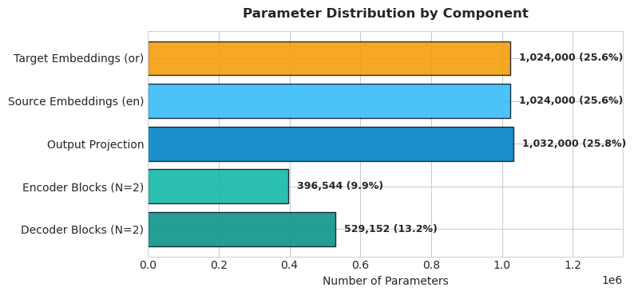

## Results

Two models were trained and are compared throughout the dashboard and write-up:

| | Baseline | Scaled |
|---|---|---|
| Parameters | 4,005,696 | 11,469,824 |
| Layers (enc + dec) | 2 + 2 | 4 + 4 |
| Hidden size | 128 | 256 |
| Attention heads | 4 | 8 |
| Hardware | Kaggle CPU | Tesla T4 GPU |
| Epochs | 40 | 25 |
| Training data | 36,000 pairs | 60,000 pairs |
| Best validation loss | 2.85 | 3.56 |
| Test BLEU (greedy) | 2.60 | 0.25 |
| Test chrF++ (greedy) | 23.46 | 14.32 |

> The scaled model's 0.25 BLEU is a **greedy-decode** number, not the full picture — it was trained
> for 25 epochs vs. the baseline's 40, and greedy decoding is exactly the failure mode this project
> documents (see the [greedy-vs-beam demo](#screenshots) below). Beam search produces shorter,
> more coherent output than greedy on both models — see the real example translations in the
> Model Comparison screenshot.

Both BLEU and chrF++ are computed with `sacrebleu` over the full 2,000-sentence held-out test set
([`scripts/run_evaluation.py`](scripts/run_evaluation.py) /
[`scripts/run_scaled_evaluation.py`](scripts/run_scaled_evaluation.py)). chrF++ is a
character-level metric, useful alongside BLEU here since Odia is morphologically rich and BLEU's
word/subword n-gram matching is harsh on near-miss inflections that chrF++ still gives partial
credit for.

Each model's evaluation also includes 5 hand-picked sample translations
(`reports/eval_results.json` / `reports/scaled_eval_results.json`) — 4 chosen at random from the
test set and a 5th **deterministically selected from the ≥90th-percentile sentence length**, so
there's always a genuinely hard, long example to look at rather than only easy short ones. That
long-sentence case is what motivated the length-vs-quality study below.

Full analysis is in [`reports/write_up.md`](reports/write_up.md).

## Requirement Coverage

This project was built against a fixed set of assignment requirements — a specific
architecture, data pipeline, training setup, and evaluation protocol. Rather than just claiming
it's all there, every individual requirement is checked off against the actual code and file
that satisfies it in
[`reports/requirements_coverage.json`](reports/requirements_coverage.json):

| Category | Requirements | Status |
|---|---|---|
| Data preparation | 6 | ✅ all met |
| Model architecture | 7 | ✅ all met |
| Training | 5 | ✅ all met (1 exceeded) |
| Inference | 3 | ✅ all met (2 exceeded) |
| Evaluation | 4 | ✅ all met (1 exceeded) |
| Odia-specific handling / extra credit | 3 | ✅ all met (2 exceeded) |
| **Total** | **28** | **28/28 — 6 exceeded the requirement** |

"Exceeded" means the project does something beyond what was strictly asked for: beam search
decoding, blocking repeated word loops at generation time, proper Unicode handling for Odia's
script, and an explicit check that the decoder isn't secretly allowed to see the word it's
supposed to predict (a common and easy-to-miss bug in causal masking).

## Limitations

- **Small model, trained from scratch, on limited compute.** The baseline is 4M parameters trained
  on a CPU; the scaled model is 11.5M parameters trained on a single GPU for 25 epochs. Production
  translation systems (e.g. AI4Bharat IndicTrans2, Meta NLLB-200) use 600M–1B+ parameters trained
  on tens of millions of sentence pairs — the BLEU scores here (2.60 / 0.25) reflect that gap in
  scale, not a bug in the implementation (all 18 tests pass, including an explicit causal-mask
  leak check).
- **Quality drops sharply on longer sentences.** Both models are prone to falling into repetition
  loops as source length increases (see the Training & Benchmarks tab) — beam search with n-gram
  blocking largely fixes this, greedy decoding does not.
- **The scaled model's raw greedy BLEU is lower than the baseline's** — see [Results](#results)
  above for why, and `reports/write_up.md` for the full discussion.

## Screenshots

### Translator — empty state
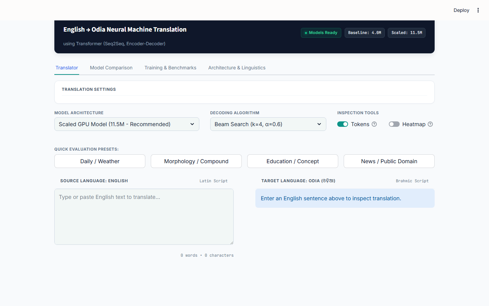

### Translator — live translation
Typing a sentence runs it through the model live, with token counts and decoding settings shown alongside the output.
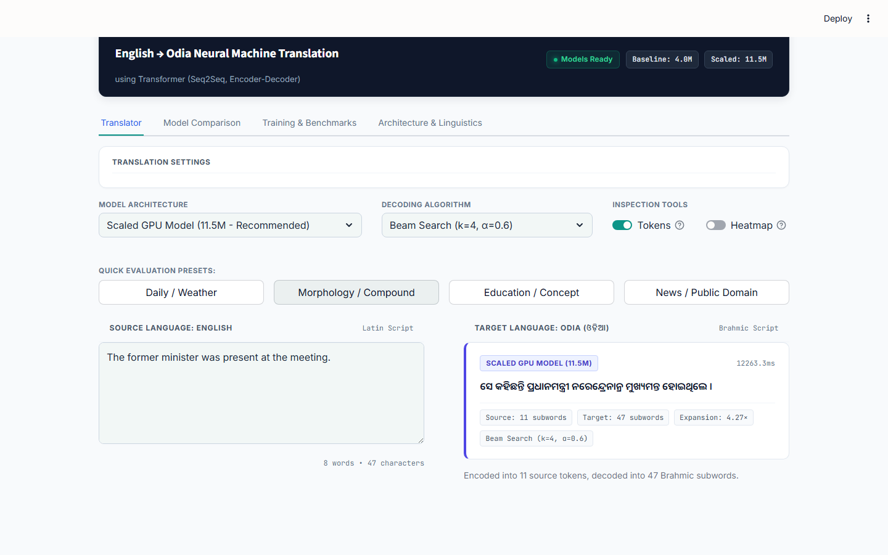

### Translator — baseline vs. scaled, side by side
Both models translating the same sentence at once, with per-model latency and token stats.
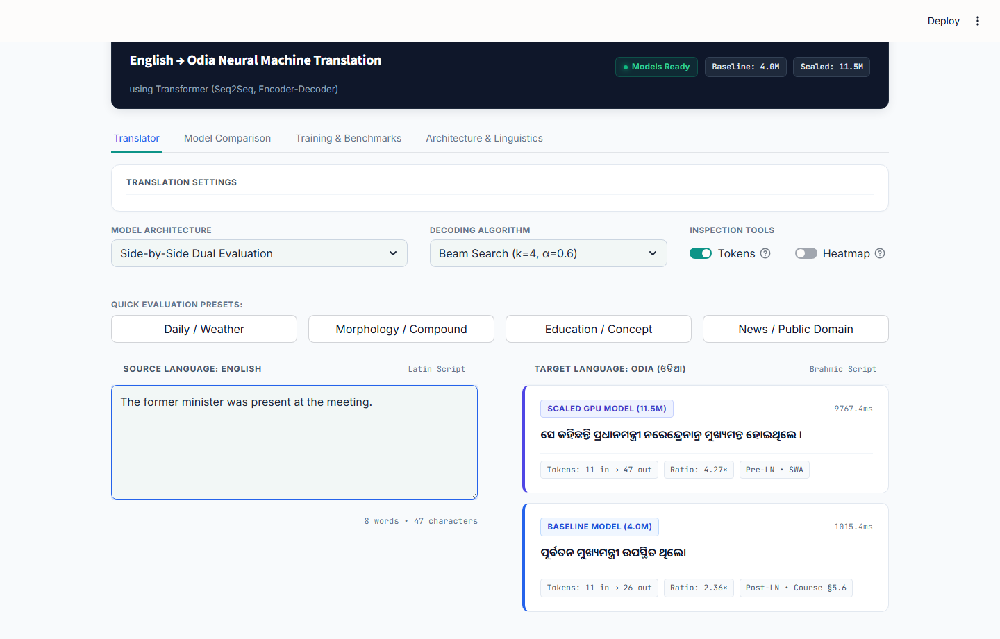

### Translator — cross-attention heatmap
Which English source tokens the model attended to while generating each Odia subword — the "extra credit" attention visualization.
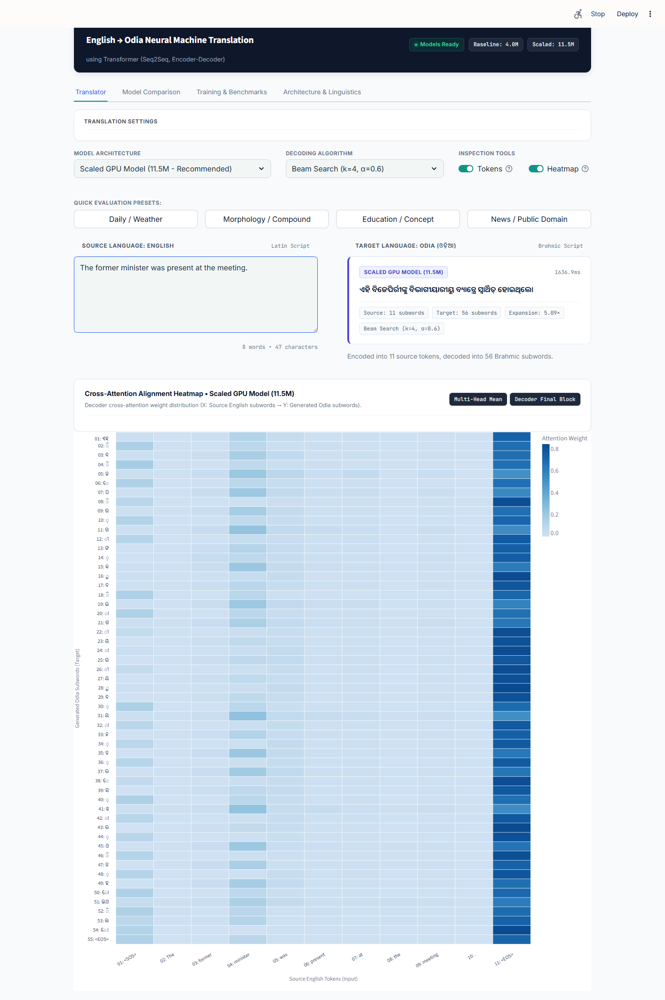

### Translator — why greedy decoding breaks on long sentences
Same 32-word sentence, same model. **Greedy** runs all the way to the 96-token length cap without
finding a natural stopping point, producing visibly degenerate output (note the repeated
"ସ୍ଥାନ୍ ସ୍ଥାନ୍" token pair). **Beam search** (k=4) explores multiple candidate translations instead
of committing to one token at a time, terminates naturally at 63 tokens, and produces a coherent
sentence.

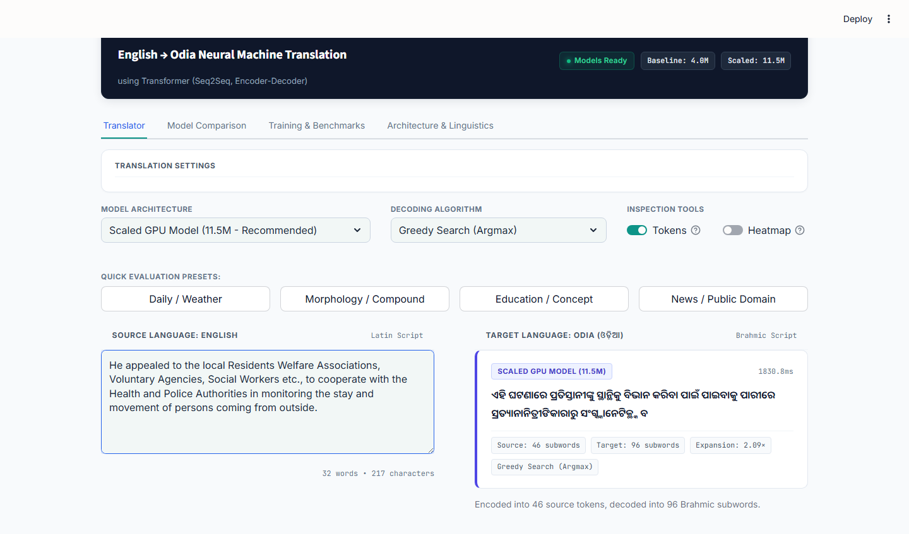
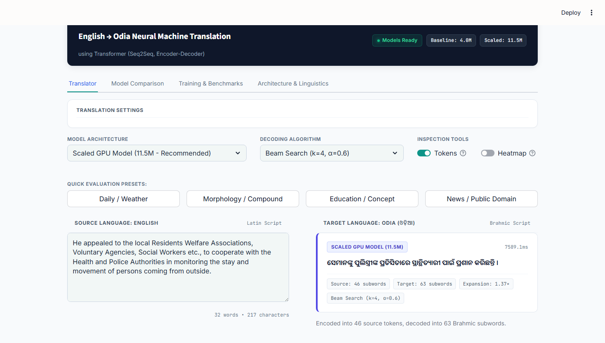

### Model Comparison
Baseline vs. scaled model in full: KPI cards, loss curves, the 4-panel comparison figure, architecture table, and example translations.
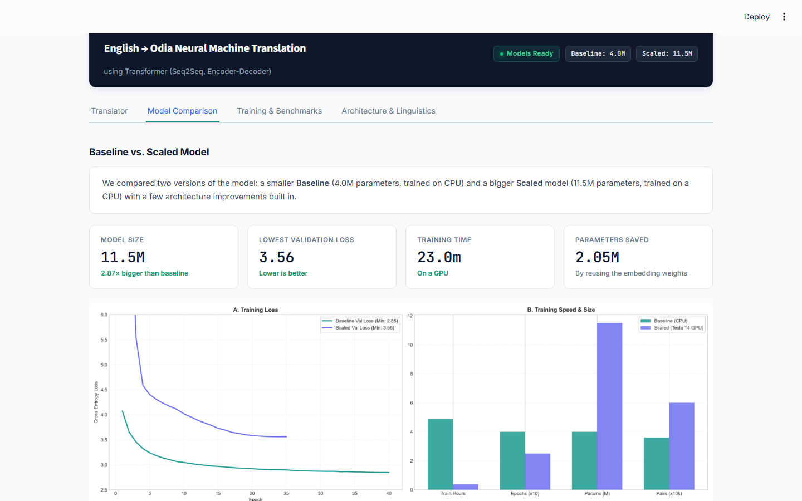

### Training & Benchmarks
Training loss curve, BLEU score, quality-vs-sentence-length analysis, the BLEU distribution, and a confusion matrix testing whether sentence length alone predicts repetition failures.
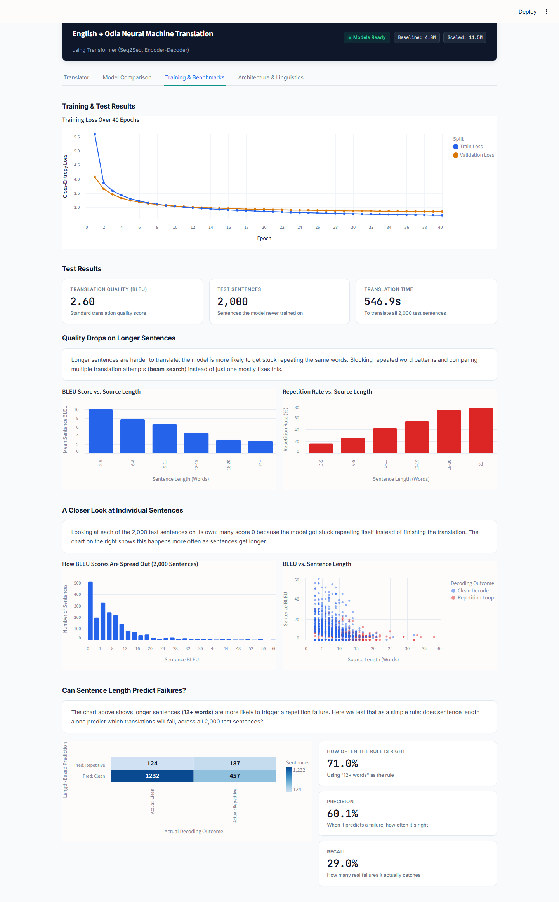

### Architecture & Linguistics
Why Odia needs more subword tokens than English, and how the text pipeline works.
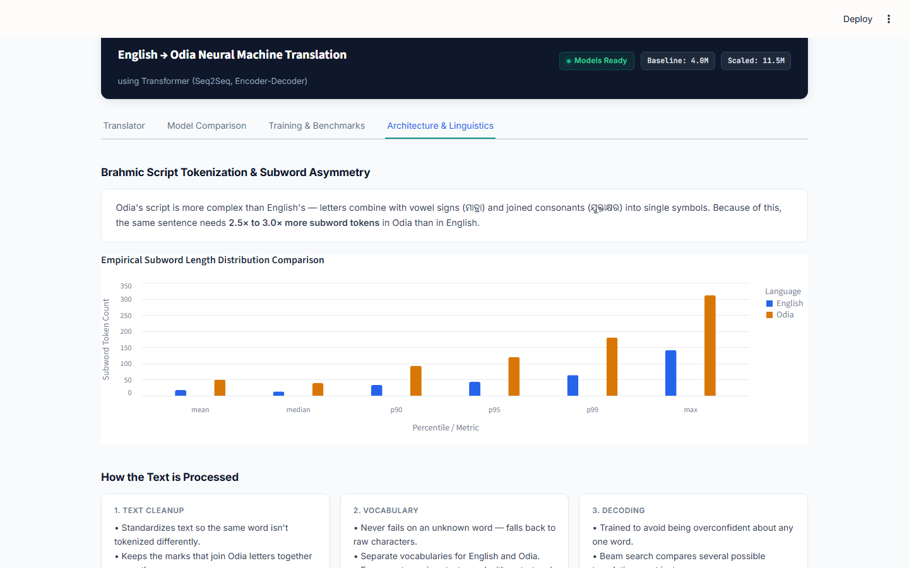

## Analysis Figures

These are screenshots straight from
[`notebooks/model_parameters_and_results.ipynb`](notebooks/model_parameters_and_results.ipynb) —
the actual code cell and its output, so you can see exactly what ran to produce each chart. Open
the notebook and run it yourself to get the same results.

### Baseline model: dataset & tokenizer stats
Pair-retention rate vs. the `MAX_LEN` cutoff, and the subword-count gap between English and Odia at the actual 8k vocabulary size.
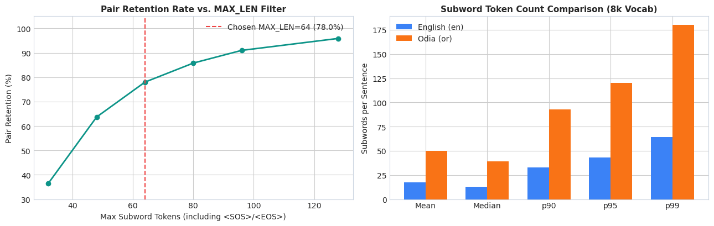

### Baseline model: training loss & perplexity
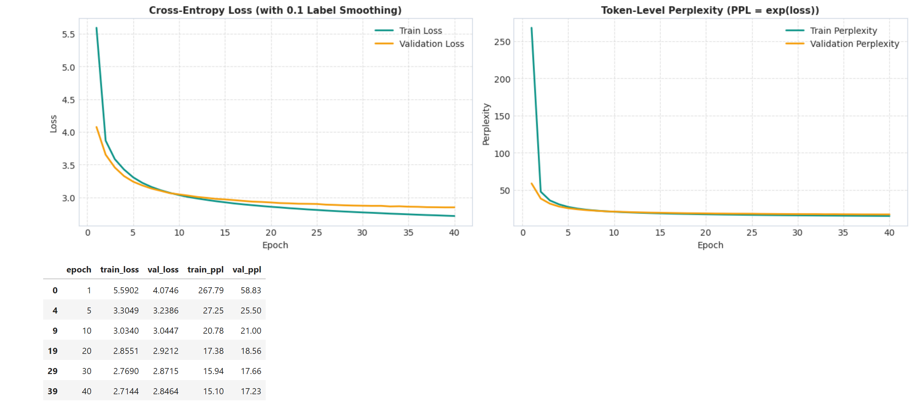

### Baseline model: BLEU and n-gram precision breakdown
Left: the n-gram precision components behind the corpus BLEU score. Right: the measured
improvement from the earlier 18-epoch/no-smoothing checkpoint to the final one.
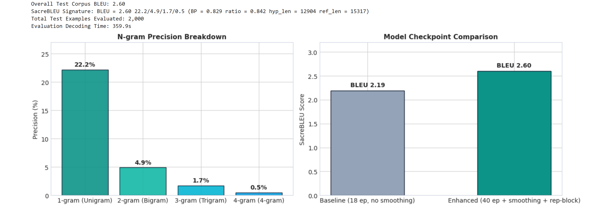

### Quality vs. sentence length
The same length-vs-quality analysis shown in the dashboard, computed directly in the notebook from the 2,000-sentence test set.
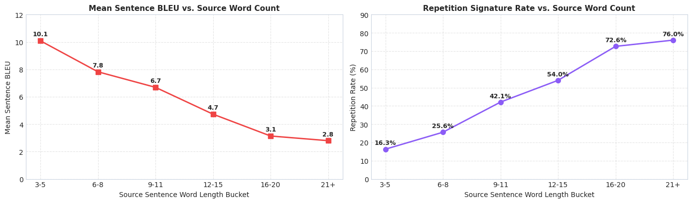

### Cross-attention heatmap
Which English source tokens the model attended to while generating each Odia subword, for the sentence *"Shutting down might cause them to lose unsaved work."* — computed from the actual attention weights extracted during decoding.
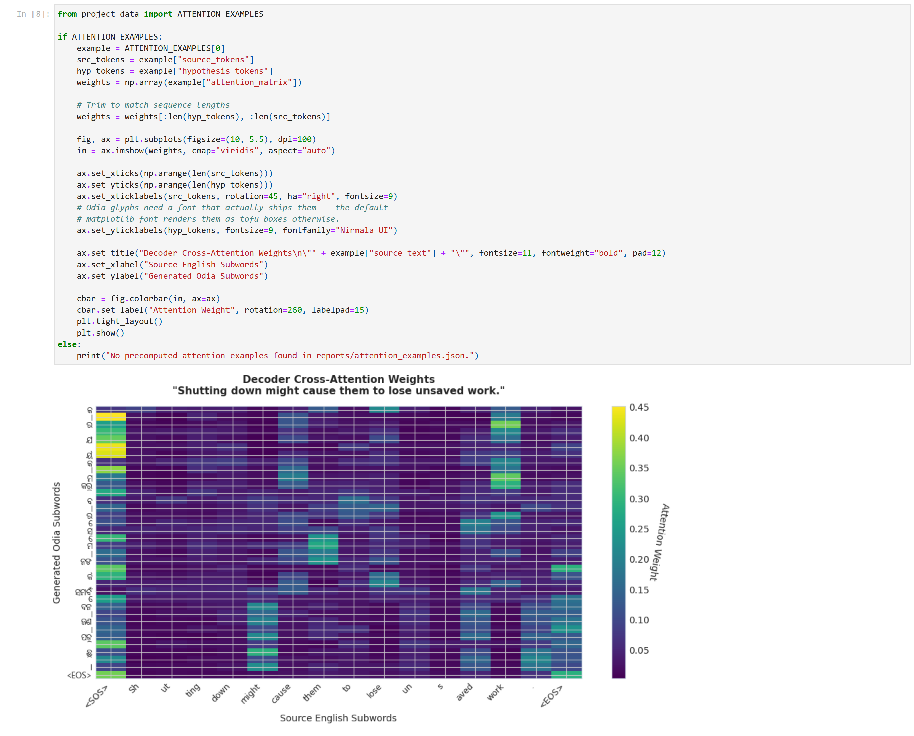

### Baseline vs. scaled: loss curves
Full-scale view plus a zoomed-in convergence region (epoch 5+). This is also the causal-mask
sanity check the assignment brief specifically warns about: if the decoder could "peek" at the
token it's supposed to predict, validation loss would collapse toward zero — dramatically and
suspiciously lower than training loss. Neither curve does that. The baseline's val and train
losses track closely together (2.85 vs. 2.71 at the final epoch); the scaled model's val loss
sits a little *below* train (3.56 vs. 3.63), which is the normal, expected effect of label
smoothing inflating the reported training loss and dropout being active only during training —
not the sharp collapse a real masking leak would cause.
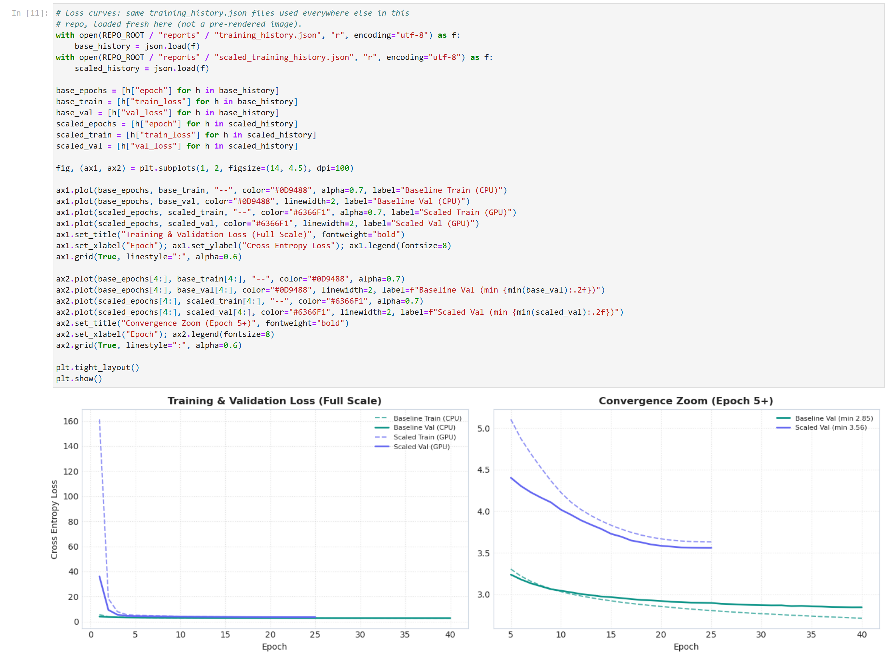

### Baseline vs. scaled: parameter breakdown by component
Both models' real `named_parameters()` counts, grouped and summed by component.
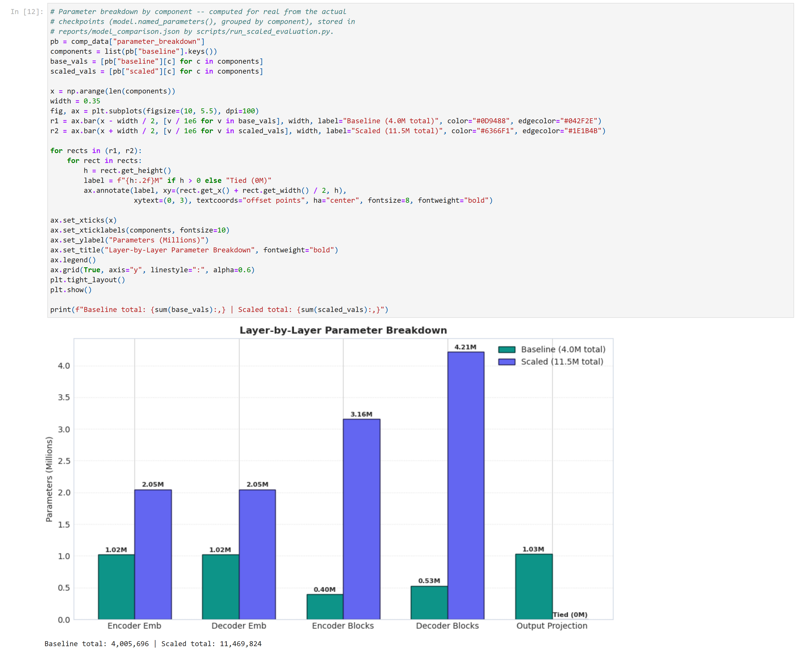

### Baseline vs. scaled: learning rate schedules
This cell imports and calls `noam_lr_lambda` from
[`src/training/lr_schedule.py`](src/training/lr_schedule.py) directly — the same function used
during training — rather than redrawing the curve from a formula.
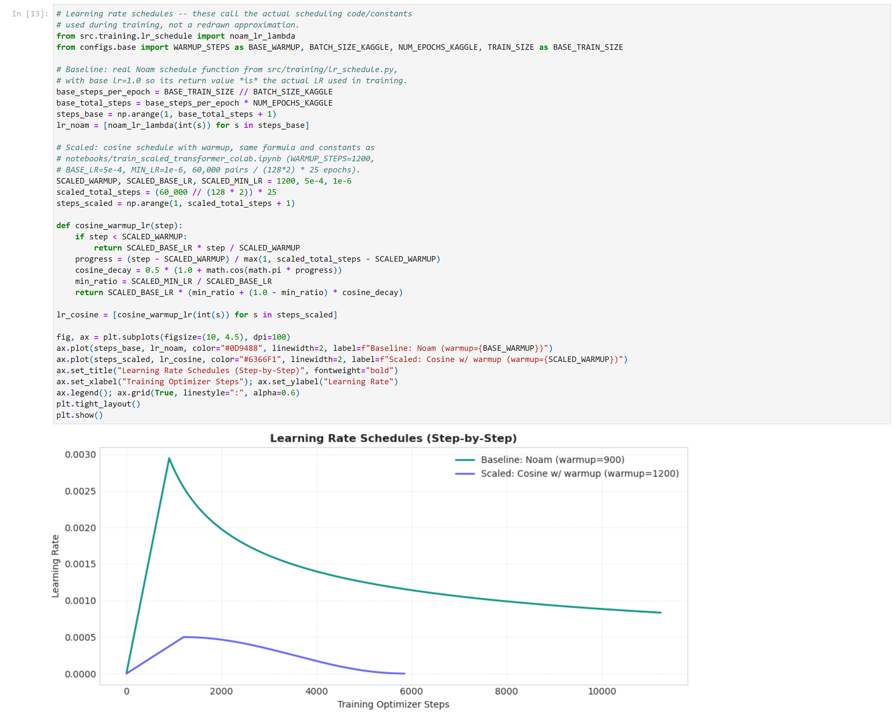

### Baseline vs. scaled: example outputs
The same three test-set sentences shown in the Model Comparison screenshot above, run through
both checkpoints ([`reports/model_comparison.json`](reports/model_comparison.json)).
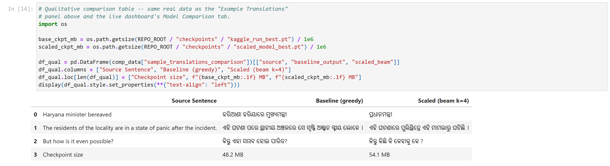

## Project Structure

```
app.py                    Streamlit dashboard (entry point)
project_data.py           Loads reports/checkpoints for the dashboard

src/                       Core library
├── data/                  Download, clean, split the parallel corpus
├── tokenization/          Byte-level BPE tokenizer training/loading
├── model/                 Transformer: attention, encoder, decoder, embeddings, masks
├── training/               Training loop, LR schedule, checkpointing
├── inference/               Greedy decode, beam search, repetition blocking, attention extraction
└── evaluation/             BLEU scoring, sample translation selection

configs/base.py            Frozen hyperparameters and paths
scripts/                   Pipeline entry points (run_eda.py, run_evaluation.py, ...)
tests/                     pytest unit + smoke tests

notebooks/                  Training notebooks
├── model_parameters_and_results.ipynb   Full walkthrough: architecture, data, training, eval
├── train_scaled_transformer_colab.ipynb  Trains the scaled model on a free Colab GPU
└── kaggle/                 Notebooks + metadata used to train on Kaggle GPU/CPU

reports/                    Results (tracked in git)
├── write_up.md              Full technical write-up
├── requirements_coverage.json
├── eval_results.json / scaled_eval_results.json
├── training_history.json / scaled_training_history.json
├── length_quality_analysis.json
└── figures/                  Generated comparison charts (gitignored, regenerate via scripts)

docs/screenshots/           Dashboard screenshots used in this README
docs/figures/               Full-resolution analysis figures used in this README

data/, tokenizers/, checkpoints/   Generated locally by the pipeline (gitignored)
```

## Setup

```bash
pip install -r requirements.txt
```

## Run the Dashboard

```bash
streamlit run app.py
```

Opens at `http://localhost:8501` with four tabs: Translator, Model Comparison, Training &
Benchmarks, and Architecture & Linguistics.

## Reproduce the Pipeline

1. `python -m src.data.download` — download raw pairs into `data/raw/`
2. `python -m src.data.split` — clean + split into `data/processed/{train,val,test}.parquet`
3. `python -m src.tokenization.train_tokenizer` — train the English/Odia BPE tokenizers
4. Train the model — full runs were done on Kaggle (see `notebooks/kaggle/`); for a quick local
   correctness check use `python scripts/run_local_smoke_test.py`
5. `python scripts/run_evaluation.py` — BLEU + sample translations
6. `python scripts/run_length_quality_analysis.py` — BLEU/repetition vs. sentence length
7. `python scripts/run_attention_demo.py` — attention-weight extraction for the dashboard
8. `python scripts/run_eda.py` — corpus/tokenizer statistics

## Notebooks

- **`notebooks/model_parameters_and_results.ipynb`** — the main results notebook: architecture
  breakdown, dataset stats, training curves, BLEU evaluation, sample translations, length-vs-quality
  analysis, attention visualization, and a baseline-vs-scaled comparison.
- **`notebooks/train_scaled_transformer_colab.ipynb`** — trains the scaled (11.5M param) model on a
  free Google Colab T4 GPU in about 20–25 minutes.
- **`notebooks/kaggle/`** — the notebooks actually run on Kaggle to produce the checkpoints used in
  this repo (`en_or_transformer.ipynb` for the baseline, `scaled_en_or_transformer.ipynb` for the
  scaled model), plus their Kaggle kernel metadata.

## Testing

```bash
pytest tests/
```

18 tests covering causal masking, model output shapes, repetition blocking, tokenizer round-trips,
and a full training-loop smoke test (loss must actually decrease and the checkpoint must reload
correctly).

The masking tests (`tests/test_masks.py`) are worth calling out specifically, since a broken
causal mask is the failure mode the assignment brief explicitly warns about:
- `test_causal_leak_invariance_full_model` — changing a future token must not change the current
  prediction, run through the full model end-to-end
- `test_causal_mask_negative_control_has_teeth` — a deliberately *broken* mask is asserted to fail
  the test, so the leak check above isn't just trivially passing
- `test_decoder_self_attn_mask_explicit_coverage` / `test_cross_attn_mask_explicit_coverage` — the
  mask tensors themselves are checked cell-by-cell against what they should allow and block

Actual output from running `pytest tests/ -v` in this repo:

```
collected 18 items

tests/test_masks.py::test_causal_leak_invariance_full_model PASSED       [  5%]
tests/test_masks.py::test_causal_mask_negative_control_has_teeth PASSED  [ 11%]
tests/test_masks.py::test_decoder_self_attn_mask_explicit_coverage PASSED [ 16%]
tests/test_masks.py::test_cross_attn_mask_explicit_coverage PASSED       [ 22%]
tests/test_model_shapes.py::test_shapes_various_batch_and_seq_lengths PASSED [ 27%]
tests/test_model_shapes.py::test_shapes_with_right_padding PASSED        [ 33%]
tests/test_model_shapes.py::test_forward_returns_raw_logits_not_probabilities PASSED [ 38%]
tests/test_model_shapes.py::test_param_count_sanity_and_report PASSED    [ 44%]
tests/test_repetition.py::test_banned_ngram_tokens_blocks_the_completing_token PASSED [ 50%]
tests/test_repetition.py::test_banned_ngram_tokens_empty_when_no_repeat_yet PASSED [ 55%]
tests/test_repetition.py::test_banned_ngram_tokens_short_sequence_returns_empty PASSED [ 61%]
tests/test_repetition.py::test_greedy_decode_never_repeats_ngram_on_random_model PASSED [ 66%]
tests/test_tokenizer.py::test_special_token_ids_en PASSED                [ 72%]
tests/test_tokenizer.py::test_special_token_ids_or PASSED                [ 77%]
tests/test_tokenizer.py::test_roundtrip_english PASSED                   [ 83%]
tests/test_tokenizer.py::test_roundtrip_odia PASSED                      [ 88%]
tests/test_tokenizer.py::test_odia_encoding_wraps_with_sos_eos PASSED    [ 94%]
tests/test_training_smoke.py::test_loss_decreases_and_checkpoint_round_trips PASSED [100%]

============================= 18 passed in 48.21s =============================
```

## Data & Acknowledgments

Training data is the English–Odia (`or`) config of
[AI4Bharat Samanantar](https://huggingface.co/datasets/ai4bharat/samanantar) (Ramesh et al., 2021),
a large-scale parallel corpus for Indic languages.
