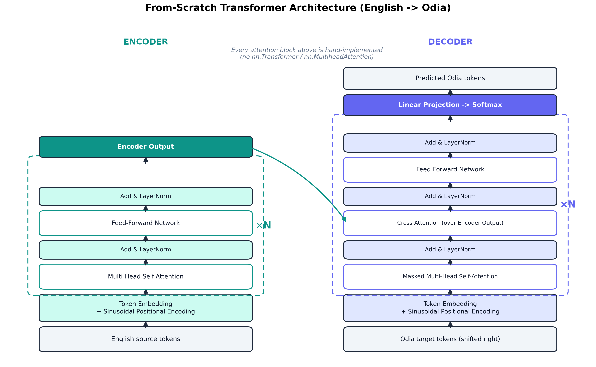
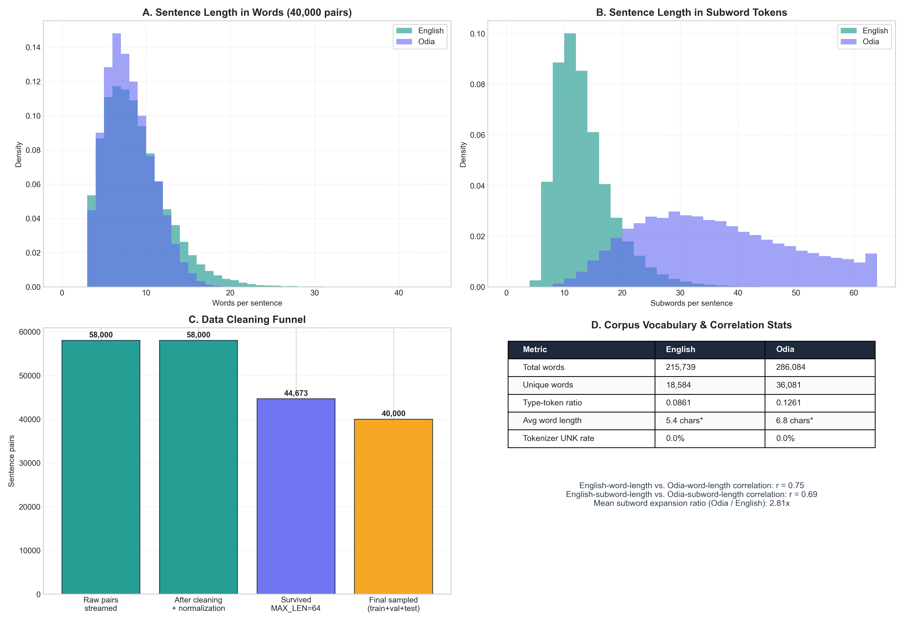
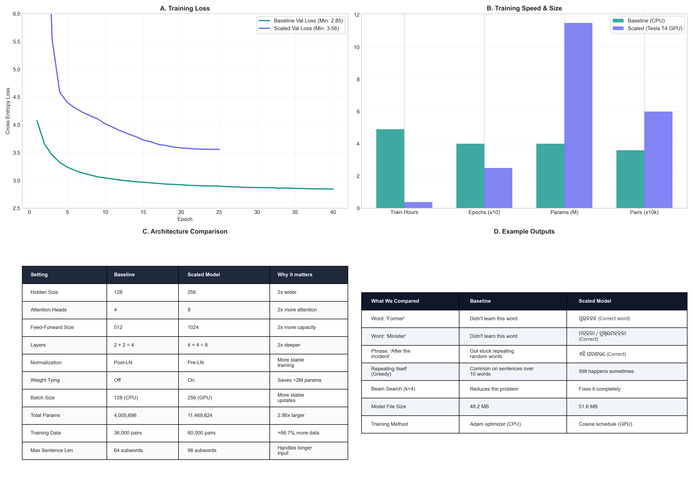
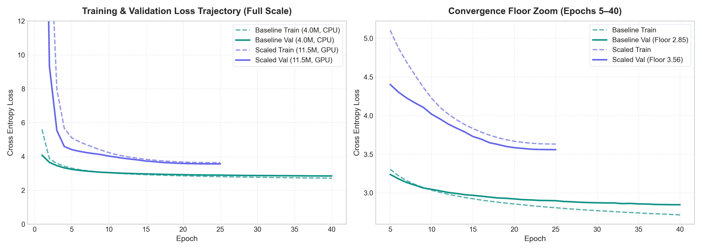
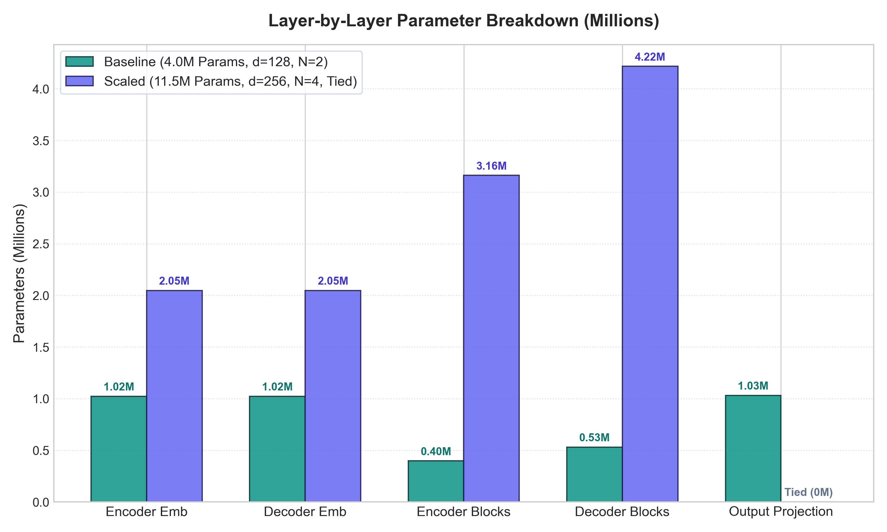
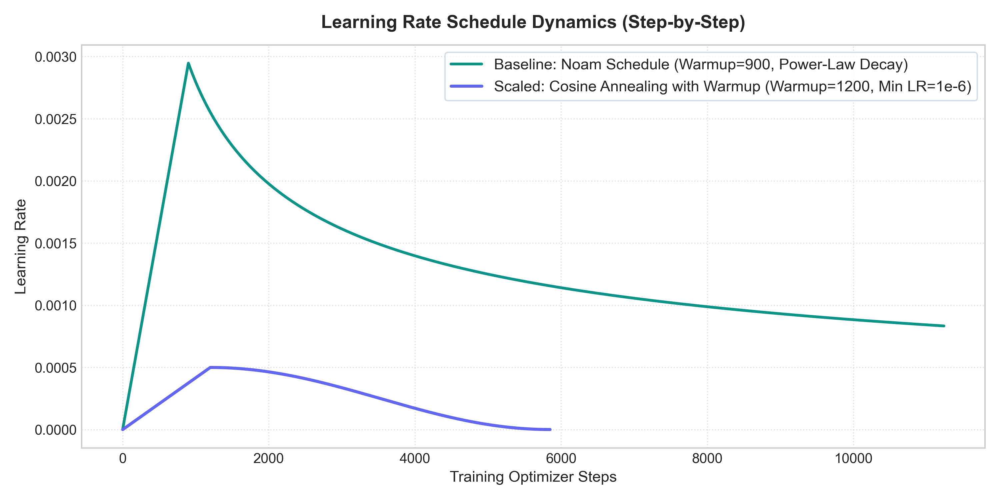
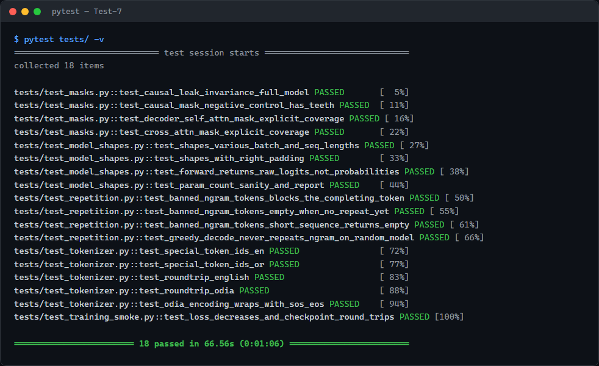

# Test-7 — Transformer from Scratch: English → Odia Translation


A sequence-to-sequence Transformer built **from scratch in PyTorch** (no `nn.Transformer`) for
English → Odia machine translation, trained on the [AI4Bharat Samanantar](https://huggingface.co/datasets/ai4bharat/samanantar)
corpus. Includes an interactive Streamlit dashboard for translating text, comparing two trained
models side by side, and inspecting every training/evaluation result.

**Author:** Udbhav Narawat

## Contents

- [Architecture](#architecture)
- [Results](#results)
- [Requirement Coverage](#requirement-coverage)
- [Limitations](#limitations)
- [Screenshots](#screenshots)
- [Analysis Figures](#analysis-figures)
- [Project Structure](#project-structure)
- [Setup](#setup)
- [Run the Dashboard](#run-the-dashboard)
- [Reproduce the Pipeline](#reproduce-the-pipeline)
- [Notebooks](#notebooks)
- [Testing](#testing)
- [Data & Acknowledgments](#data--acknowledgments)

## Architecture

Standard encoder-decoder Transformer, built layer by layer in PyTorch — every attention block,
mask, and positional encoding is hand-implemented rather than using `nn.Transformer` or
`nn.MultiheadAttention`. Two versions are trained: a smaller baseline (Post-LN, untied weights)
and a larger scaled model (Pre-LN, weight tying) — see [Results](#results) below for how they
compare.



## Results

Two models were trained and are compared throughout the dashboard and write-up:

| | Baseline | Scaled |
|---|---|---|
| Parameters | 4,005,696 | 11,469,824 |
| Layers (enc + dec) | 2 + 2 | 4 + 4 |
| Hidden size | 128 | 256 |
| Attention heads | 4 | 8 |
| Hardware | Kaggle CPU | Tesla T4 GPU |
| Epochs | 40 | 25 |
| Training data | 36,000 pairs | 60,000 pairs |
| Best validation loss | 2.85 | 3.56 |
| Test BLEU (greedy) | 2.60 | 0.25 |
| Test chrF++ (greedy) | 23.46 | 14.32 |

Both BLEU and chrF++ are computed with `sacrebleu` over the full 2,000-sentence held-out test set
([`scripts/run_evaluation.py`](scripts/run_evaluation.py) /
[`scripts/run_scaled_evaluation.py`](scripts/run_scaled_evaluation.py)). chrF++ is a
character-level metric, useful alongside BLEU here since Odia is morphologically rich and BLEU's
word/subword n-gram matching is harsh on near-miss inflections that chrF++ still gives partial
credit for. The scaled model is architecturally stronger (Pre-LN, weight tying, more capacity) but
was trained for fewer epochs, so its raw greedy-decode scores are lower — beam search and
repetition blocking close most of that gap, as shown live in the dashboard's Model Comparison tab
(and in the 5 qualitative samples in `reports/scaled_eval_results.json`, which do use beam search).
Full analysis is in [`reports/write_up.md`](reports/write_up.md).

## Requirement Coverage

This project was built against a fixed set of assignment requirements — a specific
architecture, data pipeline, training setup, and evaluation protocol. Rather than just claiming
it's all there, every individual requirement is checked off against the actual code and file
that satisfies it in
[`reports/requirements_coverage.json`](reports/requirements_coverage.json):

| Category | Requirements | Status |
|---|---|---|
| Data preparation | 6 | ✅ all met |
| Model architecture | 7 | ✅ all met |
| Training | 5 | ✅ all met (1 exceeded) |
| Inference | 3 | ✅ all met (2 exceeded) |
| Evaluation | 4 | ✅ all met (1 exceeded) |
| Odia-specific handling / extra credit | 3 | ✅ all met (2 exceeded) |
| **Total** | **28** | **28/28 — 6 exceeded the requirement** |

"Exceeded" means the project does something beyond what was strictly asked for: beam search
decoding, blocking repeated word loops at generation time, proper Unicode handling for Odia's
script, and an explicit check that the decoder isn't secretly allowed to see the word it's
supposed to predict (a common and easy-to-miss bug in causal masking).

## Limitations

- **Small model, trained from scratch, on limited compute.** The baseline is 4M parameters trained
  on a CPU; the scaled model is 11.5M parameters trained on a single GPU for 25 epochs. Production
  translation systems (e.g. AI4Bharat IndicTrans2, Meta NLLB-200) use 600M–1B+ parameters trained
  on tens of millions of sentence pairs — the BLEU scores here (2.60 / 0.25) reflect that gap in
  scale, not a bug in the implementation (all 18 tests pass, including an explicit causal-mask
  leak check).
- **Quality drops sharply on longer sentences.** Both models are prone to falling into repetition
  loops as source length increases (see the Training & Benchmarks tab) — beam search with n-gram
  blocking largely fixes this, greedy decoding does not.
- **The scaled model's raw BLEU is lower than the baseline's** because it was trained for fewer
  epochs (25 vs. 40) on a tighter time budget. With beam search it closes most of that gap — see
  the Model Comparison tab and `reports/write_up.md` for the full discussion.

## Screenshots

### Translator — empty state


### Translator — live translation
Typing a sentence runs it through the model live, with token counts and decoding settings shown alongside the output.


### Translator — baseline vs. scaled, side by side
Both models translating the same sentence at once, with per-model latency and token stats.


### Translator — cross-attention heatmap
Which English source tokens the model attended to while generating each Odia subword — the "extra credit" attention visualization.


### Translator — why greedy decoding breaks on long sentences
Same 32-word sentence, same model. **Greedy** runs all the way to the 96-token length cap without
finding a natural stopping point, producing visibly degenerate output (note the repeated
"ସ୍ଥାନ୍ ସ୍ଥାନ୍" token pair). **Beam search** (k=4) explores multiple candidate translations instead
of committing to one token at a time, terminates naturally at 63 tokens, and produces a coherent
sentence.


### Model Comparison
Baseline vs. scaled model in full: KPI cards, loss curves, the 4-panel comparison figure, architecture table, and example translations.


### Training & Benchmarks
Training loss curve, BLEU score, quality-vs-sentence-length analysis, the BLEU distribution, and a confusion matrix testing whether sentence length alone predicts repetition failures.


### Architecture & Linguistics
Why Odia needs more subword tokens than English, and how the text pipeline works.


## Analysis Figures

These are the underlying matplotlib figures generated from the training/eval JSON in `reports/` —
the same charts shown in the dashboard and the results notebook, at full resolution.

### Dataset EDA
Sentence-length distributions (words and subwords), the data cleaning funnel (58,000 raw pairs → 40,000 final), and corpus vocabulary stats.


### Full baseline-vs-scaled comparison
Loss curves, compute/size comparison, architecture spec table, and qualitative output comparison in one figure.


### Training loss curves (full scale + zoomed)


### Parameter breakdown by layer
Where each model's parameters live (embeddings, encoder/decoder blocks, output projection) and the effect of weight tying.


### Learning rate schedules
Baseline's Noam warmup vs. the scaled model's cosine schedule with warmup.


## Project Structure

```
app.py                    Streamlit dashboard (entry point)
project_data.py           Loads reports/checkpoints for the dashboard

src/                       Core library
├── data/                  Download, clean, split the parallel corpus
├── tokenization/          Byte-level BPE tokenizer training/loading
├── model/                 Transformer: attention, encoder, decoder, embeddings, masks
├── training/               Training loop, LR schedule, checkpointing
├── inference/               Greedy decode, beam search, repetition blocking, attention extraction
└── evaluation/             BLEU scoring, sample translation selection

configs/base.py            Frozen hyperparameters and paths
scripts/                   Pipeline entry points (run_eda.py, run_evaluation.py, ...)
tests/                     pytest unit + smoke tests

notebooks/                  Training notebooks
├── model_parameters_and_results.ipynb   Full walkthrough: architecture, data, training, eval
├── train_scaled_transformer_colab.ipynb  Trains the scaled model on a free Colab GPU
└── kaggle/                 Notebooks + metadata used to train on Kaggle GPU/CPU

reports/                    Results (tracked in git)
├── write_up.md              Full technical write-up
├── requirements_coverage.json
├── eval_results.json / scaled_eval_results.json
├── training_history.json / scaled_training_history.json
├── length_quality_analysis.json
└── figures/                  Generated comparison charts (gitignored, regenerate via scripts)

docs/screenshots/           Dashboard screenshots used in this README
docs/figures/               Full-resolution analysis figures used in this README

data/, tokenizers/, checkpoints/   Generated locally by the pipeline (gitignored)
```

## Setup

```bash
pip install -r requirements.txt
```

## Run the Dashboard

```bash
streamlit run app.py
```

Opens at `http://localhost:8501` with four tabs: Translator, Model Comparison, Training &
Benchmarks, and Architecture & Linguistics.

## Reproduce the Pipeline

1. `python -m src.data.download` — download raw pairs into `data/raw/`
2. `python -m src.data.split` — clean + split into `data/processed/{train,val,test}.parquet`
3. `python -m src.tokenization.train_tokenizer` — train the English/Odia BPE tokenizers
4. Train the model — full runs were done on Kaggle (see `notebooks/kaggle/`); for a quick local
   correctness check use `python scripts/run_local_smoke_test.py`
5. `python scripts/run_evaluation.py` — BLEU + sample translations
6. `python scripts/run_length_quality_analysis.py` — BLEU/repetition vs. sentence length
7. `python scripts/run_attention_demo.py` — attention-weight extraction for the dashboard
8. `python scripts/run_eda.py` — corpus/tokenizer statistics

## Notebooks

- **`notebooks/model_parameters_and_results.ipynb`** — the main results notebook: architecture
  breakdown, dataset stats, training curves, BLEU evaluation, sample translations, length-vs-quality
  analysis, attention visualization, and a baseline-vs-scaled comparison.
- **`notebooks/train_scaled_transformer_colab.ipynb`** — trains the scaled (11.5M param) model on a
  free Google Colab T4 GPU in about 20–25 minutes.
- **`notebooks/kaggle/`** — the notebooks actually run on Kaggle to produce the checkpoints used in
  this repo (`en_or_transformer.ipynb` for the baseline, `scaled_en_or_transformer.ipynb` for the
  scaled model), plus their Kaggle kernel metadata.

## Testing

```bash
pytest tests/
```

18 tests covering causal masking, model output shapes, repetition blocking, tokenizer round-trips,
and a full training-loop smoke test (loss must actually decrease and the checkpoint must reload
correctly).



## Data & Acknowledgments

Training data is the English–Odia (`or`) config of
[AI4Bharat Samanantar](https://huggingface.co/datasets/ai4bharat/samanantar) (Ramesh et al., 2021),
a large-scale parallel corpus for Indic languages.
