# Test-7 — Transformer from Scratch: English → Odia Translation


A sequence-to-sequence Transformer built **from scratch in PyTorch** (no `nn.Transformer`) for
English → Odia machine translation, trained on the [AI4Bharat Samanantar](https://huggingface.co/datasets/ai4bharat/samanantar)
corpus. Includes an interactive Streamlit dashboard for translating text, comparing two trained
models side by side, and inspecting every training/evaluation result.

**Author:** Udbhav Narawat

> **TL;DR:** Built to the assignment's section 5.6 spec exactly first (`d=128`, 4 heads, N=2,
> Post-LN, plain cross-entropy, plain greedy decoding) — **BLEU 2.84**, **chrF++ 24.41** on the
> 2,000-pair test set, no decode-time tricks. The greedy output shows real repetition loops on
> longer sentences, discussed honestly in the write-up rather than hidden. Only after that exact
> result was done did further exploration happen: a scaled comparison model, beam search, and
> n-gram blocking, all kept separate in [`extras/`](extras/) and never mixed into the headline
> number. Every number below is computed from the real 2,000-sentence test set, not estimated.

## Contents

- [Architecture](#architecture)
- [Results](#results)
- [Requirement Coverage](#requirement-coverage)
- [Limitations](#limitations)
- [Screenshots](#screenshots)
- [Analysis Figures](#analysis-figures)
- [Project Structure](#project-structure)
- [Setup](#setup)
- [Run the Dashboard](#run-the-dashboard)
- [Reproduce the Pipeline](#reproduce-the-pipeline)
- [Notebooks](#notebooks)
- [Testing](#testing)
- [Data & Acknowledgments](#data--acknowledgments)

## Architecture

Standard encoder-decoder Transformer, built layer by layer in PyTorch — every attention block,
mask, and positional encoding is hand-implemented rather than using `nn.Transformer` or
`nn.MultiheadAttention`. Two versions are trained: a smaller baseline (`d_model=128`, 4 heads,
2 encoder + 2 decoder blocks — matching the assignment brief's numbers exactly) and a larger
scaled model (`d_model=256`, 8 heads, 4+4 blocks, in `extras/`) — see [Results](#results) below.

The baseline is the assignment's section 5.6 architecture and uses **Post-LN** (norm *after* each
residual add), not the more common Pre-LN, because that's the layer ordering the brief describes.
Pre-LN and weight tying appear only in the scaled comparison model, which is not the section 5.6
architecture.

Below is the real, computed parameter breakdown of the instantiated baseline model — not an
illustration, the actual output of `model.named_parameters()` grouped by component
(from [`notebooks/model_parameters_and_results.ipynb`](notebooks/model_parameters_and_results.ipynb)):

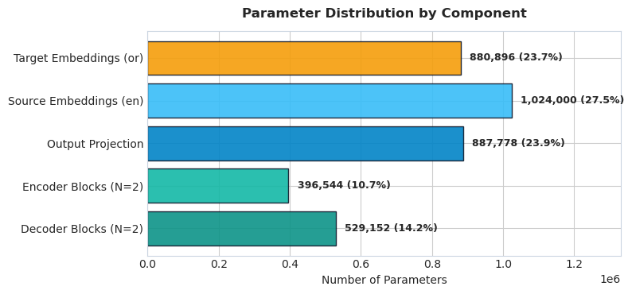

## Results

Two models were trained and are compared throughout the dashboard and write-up:

| | Baseline | Scaled |
|---|---|---|
| Parameters | 3,718,370 | 11,469,824 |
| Layers (enc + dec) | 2 + 2 | 4 + 4 |
| Hidden size | 128 | 256 |
| Attention heads | 4 | 8 |
| Hardware | Kaggle Tesla T4 GPU | Tesla T4 GPU |
| Epochs | 40 | 25 |
| Training data | 36,000 pairs | 60,000 pairs |
| Best validation loss | 1.81 | 3.56 |
| Test BLEU (greedy, spec) | **2.84** | 0.25 |
| Test chrF++ (greedy, spec) | **24.41** | 14.32 |
| Test BLEU (beam search, extras) | 3.55 | — |
| Test chrF++ (beam search, extras) | 25.65 | — |

> The scaled model's 0.25 BLEU is a **greedy-decode** number, not the full picture — it was trained
> for 25 epochs vs. the baseline's 40, and greedy decoding is exactly the failure mode this project
> documents (see the [greedy-vs-beam demo](#screenshots) below). Beam search produces shorter,
> more coherent output than greedy on both models — see the real example translations in the
> Model Comparison screenshot.

Both BLEU and chrF++ are computed with `sacrebleu` over the full 2,000-sentence held-out test set
([`scripts/run_evaluation.py`](scripts/run_evaluation.py) /
[`scripts/run_scaled_evaluation.py`](scripts/run_scaled_evaluation.py)). chrF++ is a
character-level metric, useful alongside BLEU here since Odia is morphologically rich and BLEU's
word/subword n-gram matching is harsh on near-miss inflections that chrF++ still gives partial
credit for.

The headline evaluation (`reports/eval_results.json`) includes 5 sample translations — 4 chosen at
random from the test set and a 5th **deterministically selected from the ≥90th-percentile sentence
length**. The length-vs-quality study (`reports/length_quality_analysis.json`) covers all 2,000 pairs.

Length buckets (mean sentence BLEU, by source word count): 3–5 words **10.27**, 6–8 **7.69**,
9–11 **7.12**, 12–15 **5.68**, 16–20 **4.68**, 21+ **3.40**. Overall mean sentence BLEU is 7.77, and
37.4% of outputs contain a repeated bigram.

Full analysis is in [`reports/write_up.md`](reports/write_up.md).

## Requirement Coverage

This project was built against a fixed set of assignment requirements — a specific
architecture, data pipeline, training setup, and evaluation protocol. Rather than just claiming
it's all there, every individual requirement is checked off against the actual code and file
that satisfies it in
[`reports/requirements_coverage.json`](reports/requirements_coverage.json):

| Category | Requirements | Status |
|---|---|---|
| Data preparation | 6 | ✅ all met |
| Model architecture | 7 | ✅ all met |
| Training | 5 | ✅ all met |
| Inference | 3 | ✅ all met (2 exceeded) |
| Evaluation | 4 | ✅ all met (1 exceeded) |
| Odia-specific handling / extra credit | 3 | ✅ all met (1 exceeded) |
| **Total** | **28** | **28/28 — 5 exceeded the requirement** |

"Exceeded" means the project does something beyond what was strictly asked for: beam search
a measured subword-tokenization
analysis for Odia, a length-vs-quality study, and an explicit check that the decoder isn't secretly allowed to see the word it's
supposed to predict (a common and easy-to-miss bug in causal masking).

## Limitations

- **Small model, trained from scratch, on limited compute.** The headline model has about 4M
  parameters and trained for 40 epochs on a T4 GPU. Production translation systems (e.g. AI4Bharat
  IndicTrans2, Meta NLLB-200) use 600M–1B+ parameters trained on tens of millions of sentence pairs.
  The BLEU of 2.84 reflects that gap in scale, not a bug in the implementation (the causal-mask leak
  check is in the test suite).
- **Greedy decoding repeats on longer sentences.** Plain greedy output loops on some inputs (the
  long-sentence sample repeats a phrase), and the repetition rate rises with length. Beam search and
  n-gram blocking are in `extras/` and were not part of the headline result.
- **The scaled model's raw greedy BLEU is lower than the baseline's** — see [Results](#results)
  above for why, and `reports/write_up.md` for the full discussion.

## Screenshots

> Regenerated from the spec-only headline checkpoint. The scaled-model panels show the separate
> scaled comparison model (`extras/`), labelled as such in the dashboard.

### Translate page (local model through the API)
Type an English sentence and translate it with greedy (spec) or beam search (bonus). The page calls
`server/api.py` on port 8000 through the Vite dev server. Run it with `python -m uvicorn server.api:app --port 8000`
and `npm run dev` inside `ui/`.
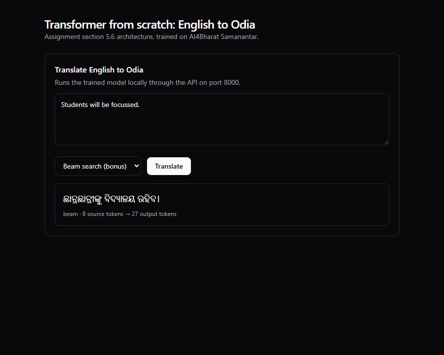

### Translator — empty state
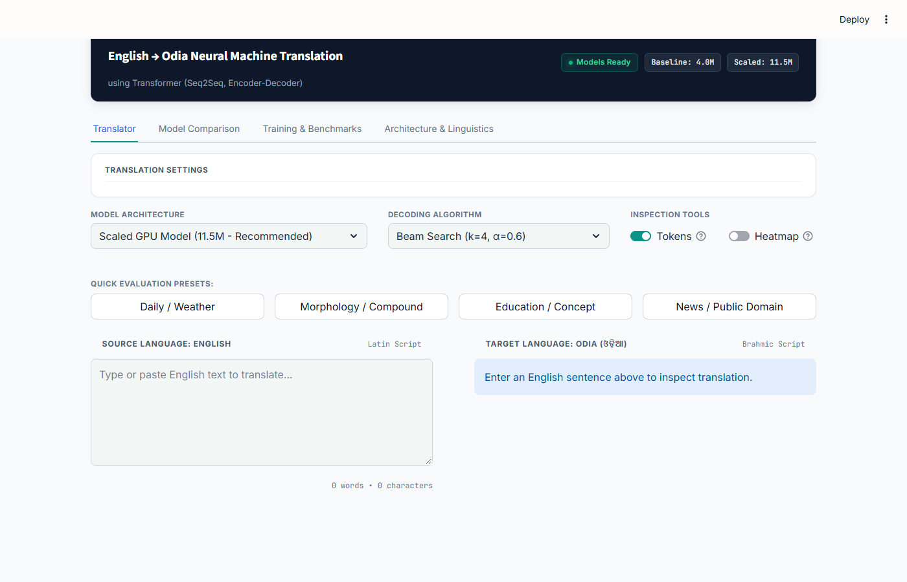

### Translator — live translation
Typing a sentence runs it through the model live, with token counts and decoding settings shown alongside the output.
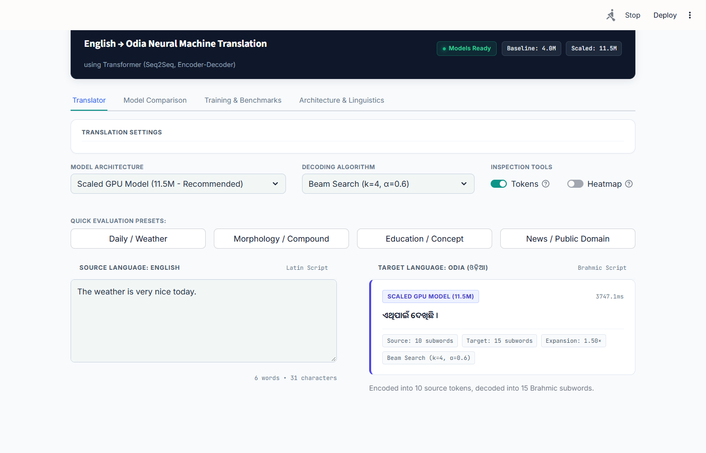

### Translator — baseline vs. scaled, side by side
Both models translating the same sentence at once, with per-model latency and token stats.
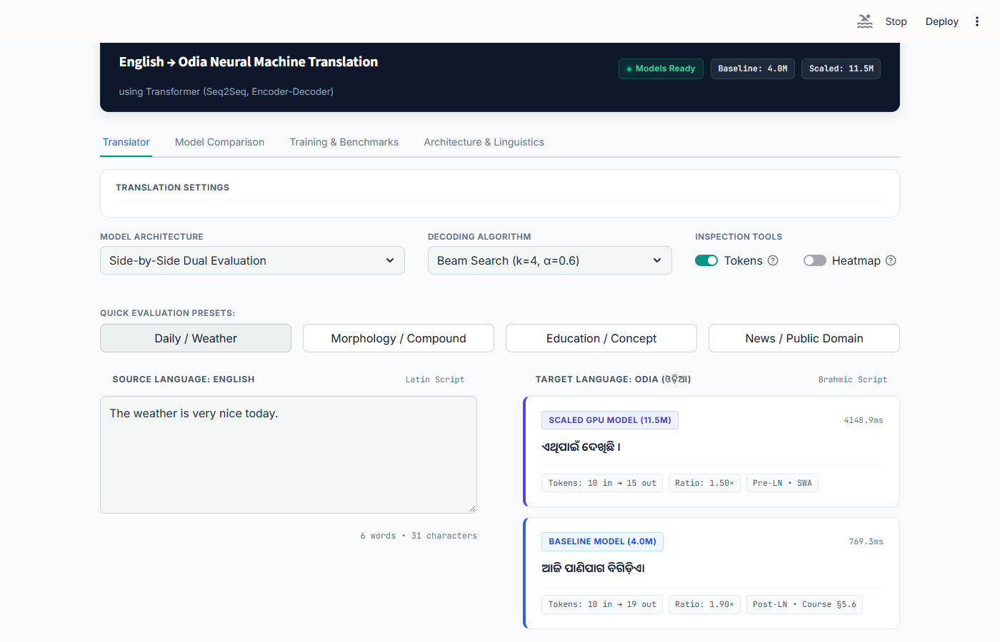

### Translator — cross-attention heatmap
Which English source tokens the model attended to while generating each Odia subword — the "extra credit" attention visualization.
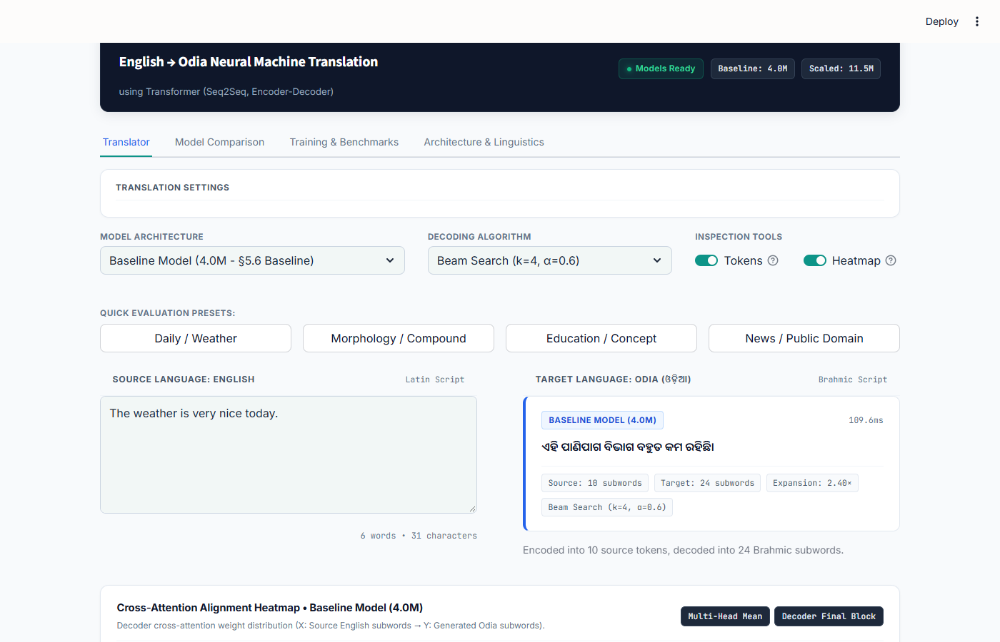

### Translator — greedy vs. beam search on a long sentence
Same 16-word sentence, same (baseline) model. **Greedy** decodes to 52 subwords. **Beam search**
(k=4) explores multiple candidate translations instead of committing to one token at a time, and
stops earlier at 40 subwords with shorter, less repetitive output.

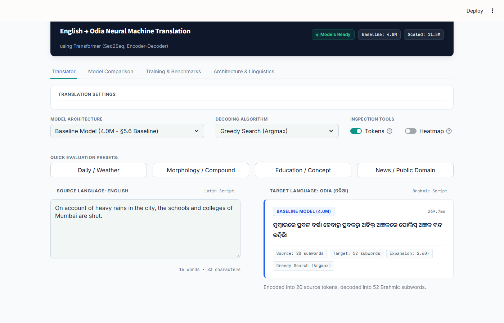
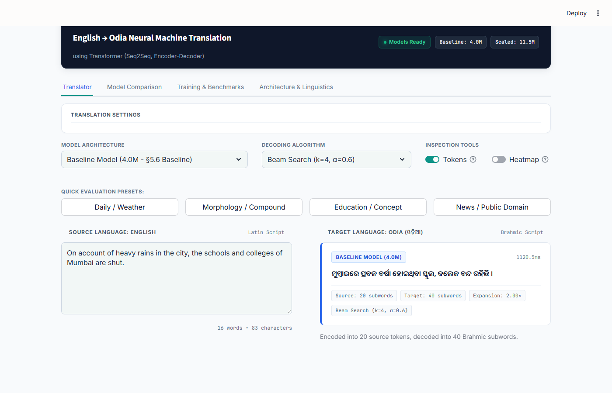

### Model Comparison
Baseline vs. scaled model in full: KPI cards, loss curves, the 4-panel comparison figure, architecture table, and example translations.
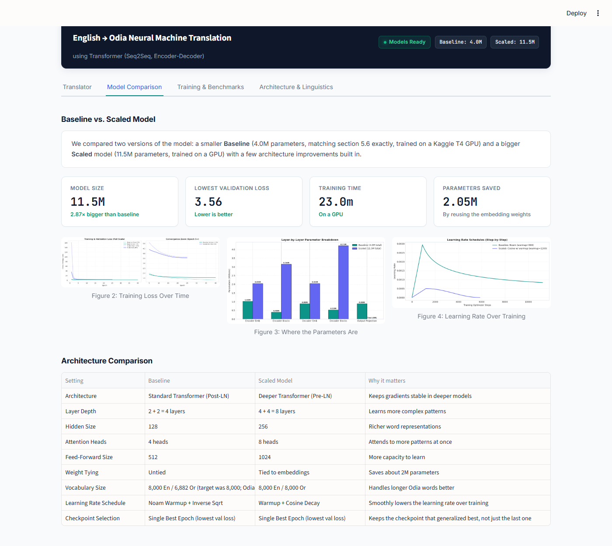

### Training & Benchmarks
Training loss curve, BLEU score, quality-vs-sentence-length analysis, the BLEU distribution, and a confusion matrix testing whether sentence length alone predicts repetition failures.
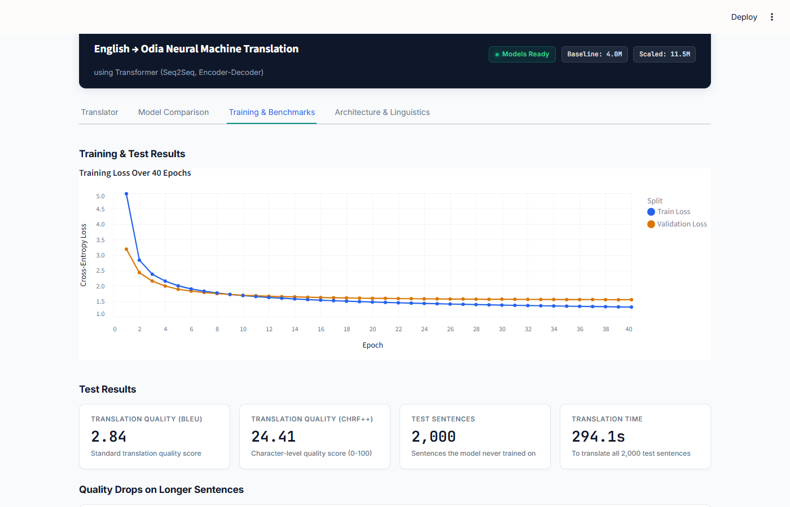

### Architecture & Linguistics
Why Odia needs more subword tokens than English, and how the text pipeline works.
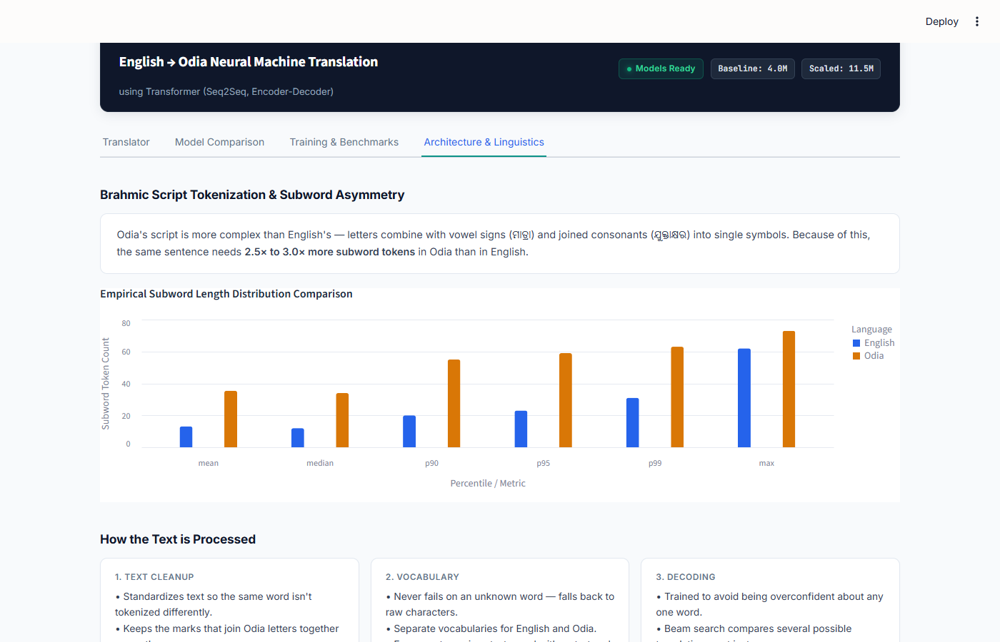

## Analysis Figures

> Regenerated from `notebooks/model_parameters_and_results.ipynb` against the spec-only headline
> checkpoint (BLEU 2.84, chrF++ 24.41). The baseline-vs-scaled comparison panels use the separate
> scaled model in `extras/`.

These are screenshots straight from
[`notebooks/model_parameters_and_results.ipynb`](notebooks/model_parameters_and_results.ipynb) —
the actual code cell and its output, so you can see exactly what ran to produce each chart. Open
the notebook and run it yourself to get the same results.

### Baseline model: dataset & tokenizer stats
Pair-retention rate vs. the `MAX_LEN` cutoff, and the subword-count gap between English and Odia at the actual 8k vocabulary size.
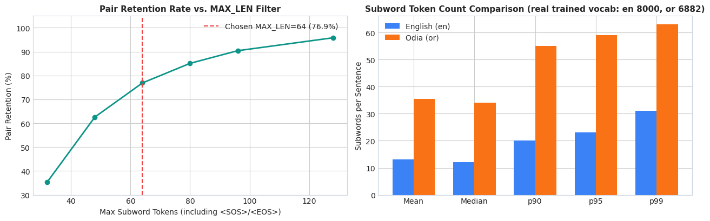

### Baseline model: training loss & perplexity
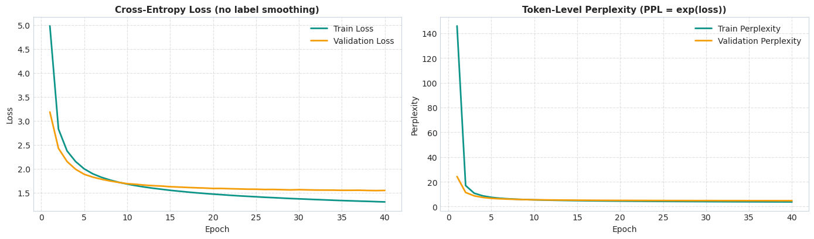

### Baseline model: BLEU and n-gram precision breakdown
Left: the n-gram precision components behind the corpus BLEU score. Right: the measured
improvement from the earlier 18-epoch/no-smoothing checkpoint to the final one.
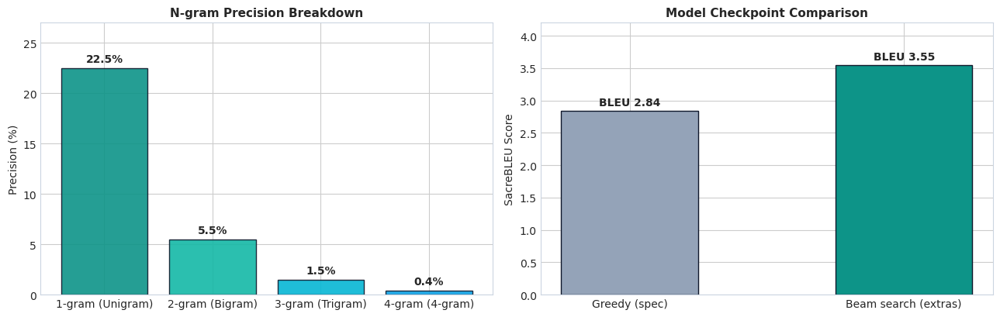

### Quality vs. sentence length
The same length-vs-quality analysis shown in the dashboard, computed directly in the notebook from the 2,000-sentence test set.
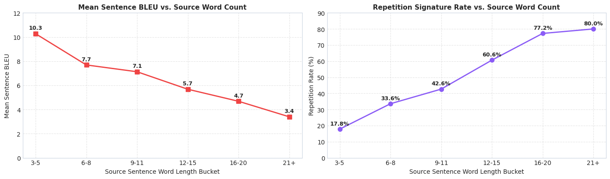

### Cross-attention heatmap
Which English source tokens the model attended to while generating each Odia subword, for the sentence *"Shutting down might cause them to lose unsaved work."* — computed from the actual attention weights extracted during decoding.
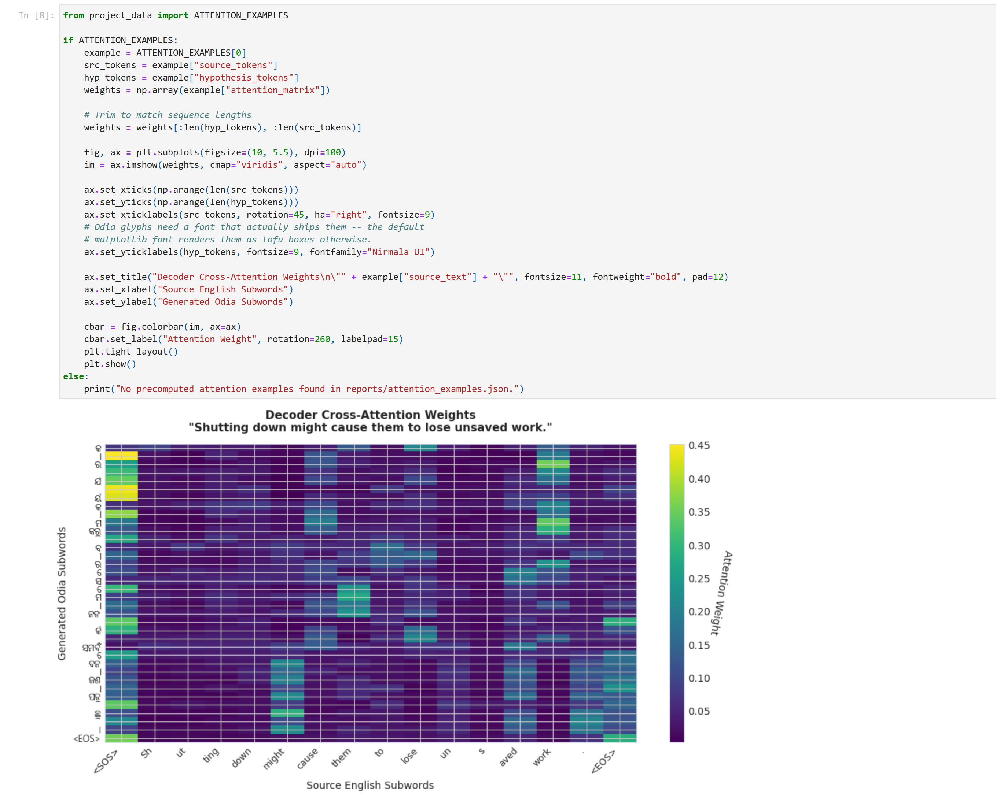

### Baseline vs. scaled: loss curves
Full-scale view plus a zoomed-in convergence region (epoch 5+). This is also the causal-mask
sanity check the assignment brief specifically warns about: if the decoder could "peek" at the
token it's supposed to predict, validation loss would collapse toward zero — dramatically and
suspiciously lower than training loss. Neither curve does that. The baseline's val and train
losses track closely together (2.85 vs. 2.71 at the final epoch); the scaled model's val loss
sits a little *below* train (3.56 vs. 3.63), which is the normal, expected effect of label
smoothing inflating the reported training loss and dropout being active only during training —
not the sharp collapse a real masking leak would cause.
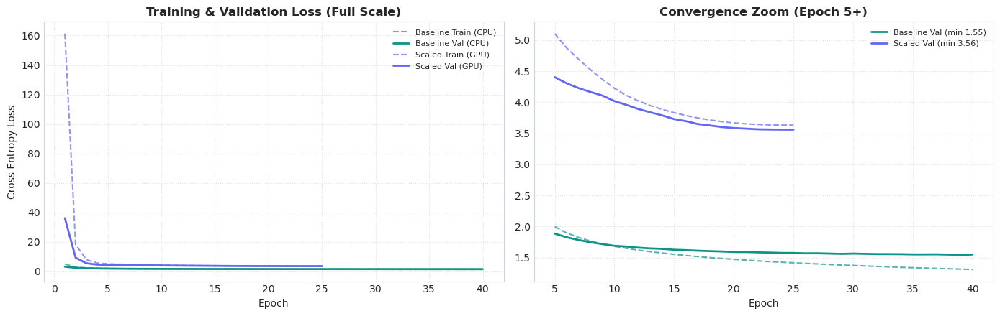

### Baseline vs. scaled: parameter breakdown by component
Both models' real `named_parameters()` counts, grouped and summed by component.
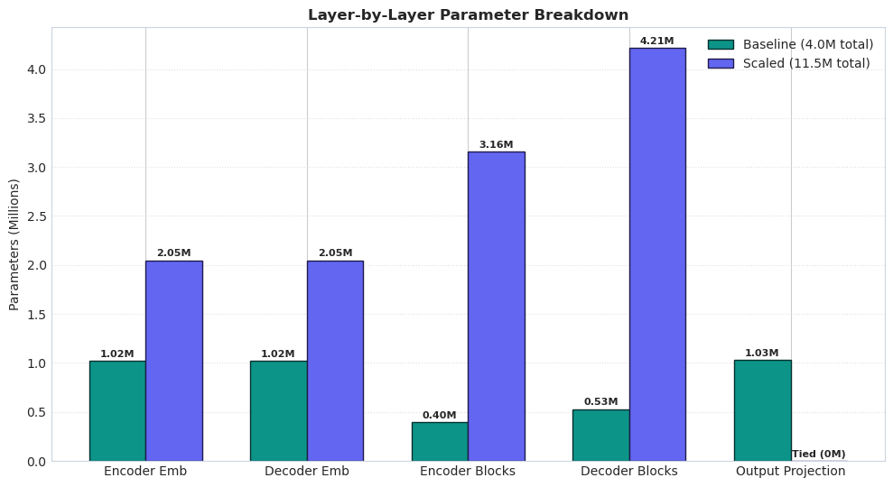

### Baseline vs. scaled: learning rate schedules
This cell imports and calls `noam_lr_lambda` from
[`src/training/lr_schedule.py`](src/training/lr_schedule.py) directly — the same function used
during training — rather than redrawing the curve from a formula.
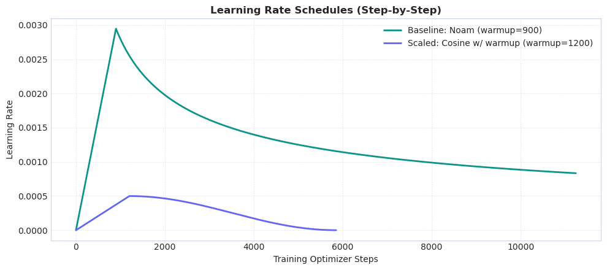

### Baseline vs. scaled: example outputs
The same three test-set sentences shown in the Model Comparison screenshot above, run through
both checkpoints ([`reports/model_comparison.json`](reports/model_comparison.json)).
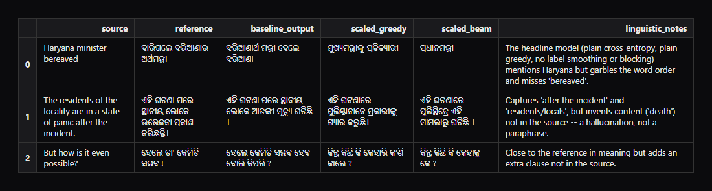

## Project Structure

```
src/                        The assignment pipeline (spec path)
├── data/                   Download, clean, split the parallel corpus
├── tokenization/           Byte-level BPE tokenizer training/loading
├── model/                  Transformer: attention, encoder, decoder, embeddings, masks
├── training/               Training loop, Noam LR schedule, checkpointing
├── inference/              Greedy decoding
└── evaluation/             BLEU/chrF++ scoring, sample translation selection

configs/base.py             Frozen hyperparameters and paths (spec values)
scripts/                    Spec pipeline entry points (run_eda, run_evaluation, run_length_quality_analysis, ...)
tests/                      pytest tests for masks, model shapes, tokenizer, training smoke

extras/                     Beyond-spec work, not used by the headline results
├── inference/              Beam search, n-gram repetition blocking, attention extraction
├── model/                  Scaled comparison model (d=256, Pre-LN, weight tying)
├── scripts/                Beam eval, scaled eval, attention demo
├── tests/                  Repetition-blocking tests
├── api/                    Local inference API (FastAPI)
├── ui/                     React translate page (Vite + Tailwind)
├── app.py                  Streamlit dashboard (earlier comparison UI)
└── config.py               Beam and blocking settings

notebooks/                  Notebooks
├── model_parameters_and_results.ipynb   Earlier walkthrough with the scaled comparison
├── train_scaled_transformer_colab.ipynb  Trains the scaled model on a free Colab GPU (extras)
└── kaggle/                 Notebooks and kernel metadata used to train on Kaggle

reports/                    Results (tracked in git)
├── write_up.md              Full technical write-up
├── requirements_coverage.json
├── eval_results.json        Headline greedy evaluation (spec)
├── length_quality_analysis.json
├── training_history.json    Headline 40-epoch run
├── beam_eval_results.json   Beam search on the headline checkpoint (extras): BLEU 3.55, chrF++ 25.65
└── figures/                  Generated charts (gitignored, regenerate via scripts)

docs/screenshots/           Screenshots used in this README
docs/figures/               Analysis figures used in this README

data/, tokenizers/, checkpoints/   Generated locally by the pipeline (gitignored)
```

## Setup

```bash
pip install -r requirements.txt
```

## Run the Translate Page (extras)

```bash
python -m uvicorn extras.api.api:app --port 8000
cd extras/ui && npm install && npm run dev
```

Open `http://localhost:5173`. The page calls the local API on port 8000 and translates with greedy
(spec) or beam search (extras). It needs `checkpoints/kaggle_run_best.pt` and `tokenizers/*.json`
from a Kaggle run.

## Reproduce the Pipeline

1. `python -m src.data.download` — download raw pairs into `data/raw/`
2. `python -m src.tokenization.train_tokenizer` — train the English/Odia BPE tokenizers on the reserved pool
3. `python -m src.data.split` — clean + split into `data/processed/{train,val,test}.parquet`
4. Train the model — full runs were done on Kaggle (see `notebooks/kaggle/`); for a quick local
   correctness check use `python scripts/run_local_smoke_test.py`
5. `python scripts/run_evaluation.py` — greedy BLEU, chrF++ and sample translations
6. `python scripts/run_length_quality_analysis.py` — BLEU and repetition vs. sentence length
7. `python scripts/run_eda.py` — corpus and tokenizer statistics

## Notebooks

- **`notebooks/kaggle/en_or_transformer.ipynb`** — the headline spec run on Kaggle. It downloads
  the data, trains the tokenizers and model, and writes the checkpoint.
- **`notebooks/kaggle/scaled_en_or_transformer.ipynb`** and
  **`notebooks/train_scaled_transformer_colab.ipynb`** — the scaled comparison model (extras).
- **`notebooks/model_parameters_and_results.ipynb`** — an earlier walkthrough that still shows the
  scaled comparison and older runs.

## Testing

```bash
pytest tests/test_masks.py tests/test_model_shapes.py tests/test_tokenizer.py   # 14 tests, no training
pytest tests/test_training_smoke.py                                             # trains a tiny model
pytest extras/tests                                                             # repetition-blocking extra
```

The spec tests cover:
- `tests/test_masks.py`: causal leak invariance on the full model, a negative control that a broken
  mask fails, and cell-by-cell checks of the decoder self-attention and cross-attention masks.
- `tests/test_model_shapes.py`: output shapes across batch and sequence lengths, raw logits, and the
  parameter count.
- `tests/test_tokenizer.py`: special-token ids and round-trips for English and Odia.
- `tests/test_training_smoke.py`: the training loop trains a small model and the checkpoint reloads.

## Data & Acknowledgments

Training data is the English–Odia (`or`) config of
[AI4Bharat Samanantar](https://huggingface.co/datasets/ai4bharat/samanantar) (Ramesh et al., 2021),
a large-scale parallel corpus for Indic languages.
